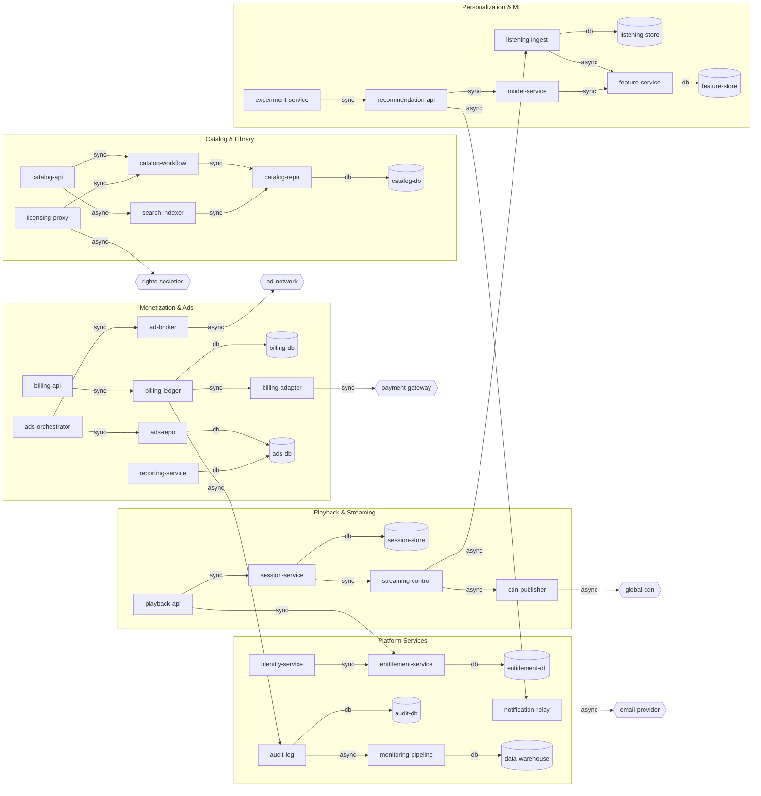

# Music Streaming Reference Architecture

This document visualizes `examples/music_streaming.yaml` with a Mermaid diagram so you can review the end-to-end topology at a glance.

## Mermaid diagram

> Tip: render the diagram locally with a Markdown viewer that supports Mermaid, or copy the snippet to [mermaid.live](https://mermaid.live) for quick experimentation.
